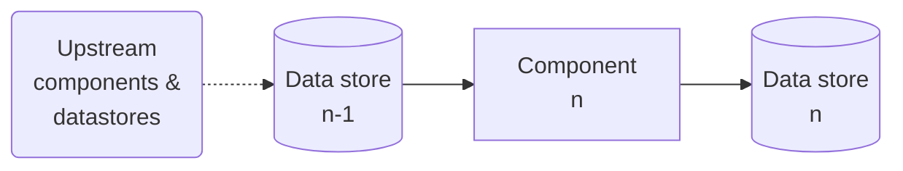

## Supervised/unsupervised learning

### Supervised learning

Training data include *labels* (desired solutions). E.g.:

- Classification  = data entry + class.
- Predict a *target* numeric value give a set of *features/predictors*.
- Attribute = data type ("Mileage").
- Feature = attribute **OR** attribute + value ("Mileage = 15,000").

## Batch and Online learning

### Batch learning:
 - System cannot learn incrementally.
 - Offline learning. Typically trained offline and launched into production to run without learning anymore.
 - Upon receiveing new data:
   - Train a new version of the system from scratch on the full dataset;
   - Stop the the old system and replace it with the new.
 - Problems: 
   - Training using the full set of data can take many hours and spend a lot of computing resources (CPU, disk I/O, network I/O, etc.).
   - Cannot adapt to rapidly changing data (e.g., predict stock prices).
   - Cannot learn autonomously under limited resources (e.g., smartphone app, rover on Mars).
  - TIP: Using the *MapReduce* technique, the batch learning work can be split across multiple servers.

### Online Learning
- System learns incrementally (data instances fed sequentially, individually or by small groups = *mini-batches*).
- Learning step is fast and cheap.
- Data can be discarded after learning (unless you want to "replay" it).
- Learning rate = how fast the system should adapt to changing data.
  - High: rapidly adapt but quickly forget.
  - Low (more inertia): slowly adapt but is more sensitive to noise or outliers (nonrepresentative data points).
- Problems:
  - Garbage in (e.g., malfunctioning sensor) = garbage out -> performance will gradually decline - and clients will notice.
- Reducing risk:
  - Monitor system closely and promptly switch learning off.
  - Revert to a previously working state.
  - Monitor input data and react to abnormal data (anomaly detection algorithm).

## Instance-Based Versus Model-Based Learning

# 2) End-to-end machine learning project

Steps:

1. Look at the big picture.
2. Get the data.
3. Discover and visualize the data to gain insights.
4. Prepare the data for Machine Learning algorithms.
5. Select a model and train it.
6. Fine-tune your model.
7. Present your solution.
8. Launch, monitor, and maintain your system.

## Frame the problem

> QUESTION 1 - What is the business objective?

Important to select:
- How you frame the problem.
- What algorithms you will select.
- What performance measure you will use to evaluate the model.
- How much effor you should spend tweaking it.

### Pipeline

A sequence of data processing *components* (typically run asynchronously) interfaced by *data stores*.

A component:
- Pulls data from a data store;
- Process data;
- Spit out the result in another data store.

Segment of data flow graph:

PROS:
 - Self-contained. Different teams can focus on different components.
 - If a component breaks down, downstream components can often continue to run normally.

CONS:
- Component can breakdown and go unnoticed (proper monitoring not implemented) = data gets stale --> performance drops.

> QUESTION 2 - What the current solution look like (if any)?

Important to have a reference performance, as well as insights on how to solve the problem.

> QUESTION 3 - Supervised, unsupervised, or RL? Classification, regression, or something else? Batch or online learning?

## Get the Data

### Create the workspace

- Create a workspace directory.
- Check/install/update `pip`.
- Create an isolated environment with `virtualenv`.
- Activate the environmnet using `source env_name/bin/activate`.
- Install modules using `pip3 install --upgrade jupyter matplotlib numpy pandas scipy scikit-learn`.
- Check installation by trying to import mudules `python3 -c "import jupyter, matplotlib, numpy, pandas, scipy, sklearn"`.

### Download the data
It is useful to automate the fetching process in order to:
-  update data that changes regurlarly and
-  install the dataset on multiple machines.

### Take a quick look at the data structure
After loading the data to a dataframe (e.g., `df`) execute:
- `info()`: quick description of the data featuring n. of rows, attribute types, and n. of non-null values (important to spot missing data);
- `df["categorical_column"].value_counts()`:  how many entries belong to each category.
- `df.describe()`: summary of numerical (non-null) attributes including `count`, `mean`, `min`, `25%` (25th percentile = 1st quartile), `50%` (median), `75%` (75th percentile = 3rd quartile), and `max`.
- `df.hist()`: histogram (n. of intances within a value a range) for all numerical attributes.

Things to be aware of:
- Attributes may be preprocessed (e.g., scaled, capped at min and max).
- Capping might incur problems if ML algorithm learns that values never go beyond/below predefined limits. Solutions:
  - Collect proper labels for capped observations.
  - Remove capped observations.
- Attributes have different scales.
- Data distribution may be *tail heavy*, extending much farther to the right of the median than to the left - and making it harder for some ML algorithms to detect patterns. Solution = transform attributes to have more bell-shaped distributions.

### Create a Test Set

# Expressions
- A component **spits out** the result in another data store.
- The estimates **were off** by 20\%.
- Taking up a lot of resources to train for hours every day is a **showstopper** (an obstacle to further progress).
- ... you are told that the data has been scaled and **capped at** 15 (actually 15.0001) for higher median incomes, and at 0.5 (actually 0.4999) for lower median incomes. 

# Basic statistics (Naked statistics - Charles Wheelan)

## Median

Neither the median nor the mean is hard to calculate; the key is determining which measure of the “middle” is more accurate in a particular situation (a phenomenon that is easily exploited). Meanwhile, the median has some useful relatives. As we’ve already discussed, the median divides a distribution in half.

## Quartile

The distribution can be further divided into quarters, or quartiles. The first quartile consists of the bottom 25 percent of the observations; the second quartile consists of the next 25 percent of the observations; and so on.

## Deciles

Or the distribution can be divided into deciles, each with 10 percent of the observations. (If your income is in the top decile of the American income distribution, you would be earning more than 90 percent of your fellow workers.)

## Percentile

A percentile indicates the value below which a given percentage of observations in a group of observations falls.

We can go even further and divide the distribution into hundredths, or percentiles. Each percentile represents 1 percent of the distribution, so that the 1st percentile represents the bottom 1 percent of the distribution and the 99th percentile represents the top 1 percent of the distribution.

The benefit of these kinds of descriptive statistics is that they describe where a particular observation lies compared with everyone else. If I tell you that your child scored in the 3rd percentile on a reading comprehension test, you should know immediately that the family should be logging more time at the library. You don’t need to know anything about the test itself, or the number of questions that your child got correct. The percentile score provides a ranking of your child’s score relative to that of all the other test takers. If the test was easy, then most test takers will have a high number of answers correct, but your child will have fewer correct than most of the others. If the test was extremely difficult, then all the test takers will have a low number of correct answers, but your child’s score will be lower still.

Here is a good point to introduce some useful terminology. An “absolute” score, number, or figure has some intrinsic meaning. If I shoot 83 for eighteen holes of golf, that is an absolute figure. I may do that on a day that is 58 degrees, which is also an absolute figure. Absolute figures can usually be interpreted without any context or additional information. When I tell you that I shot 83, you don’t need to know what other golfers shot that day in order to evaluate my performance. (The exception might be if the conditions are particularly awful, or if the course is especially difficult or easy.) If I place ninth in the golf tournament, that is a relative statistic. A “relative” value or figure has meaning only in comparison to something else, or in some broader context, such as compared with the eight golfers who shot better than I did. Most standardized tests produce results that have meaning only as a relative statistic. If I tell you that a third grader in an Illinois elementary school scored 43 out of 60 on the mathematics portion of the Illinois State Achievement Test, that absolute score doesn’t have much meaning. But when I convert it to a percentile—meaning that I put that raw score into a distribution with the math scores for all other Illinois third graders—then it acquires a great deal of meaning. If 43 correct answers falls into the 83rd percentile, then this student is doing better than most of his peers statewide. If he’s in the 8th percentile, then he’s really struggling. In this case, the percentile (the relative score) is more meaningful than the number of correct answers (the absolute score).